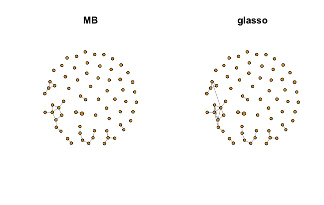
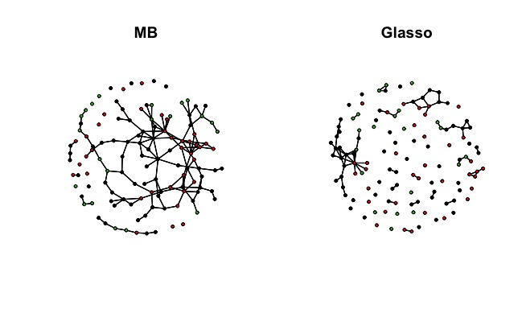

# SpiecEasi

#### Background
This package is used for taking ASV or OTU data and creating network models based on co-occurrence.  
The package page is located [here](https://github.com/zdk123/SpiecEasi) and the source paper is located [here](http://journals.plos.org/ploscompbiol/article?id=10.1371/journal.pcbi.1004226).  

## Folders and Contents
* __Tutorials__  
Includes data and code for tutorial provided on the package page. 
* __eDNA_Practice__  
Includes scripts SpiecEasi_Single.R and SpiecEasi_Multi.R which are examples of running SpiecEasi from R for a single csv or multiple csv files.    
Also contains 3 asv output tables from the Shrub/Scrub dataset and a script with commandline options for input. Will run SpiecEasi on a single file or on multiple output files for different primers. Files must be transformed to .csv format before running. Instructions for this are found in the code file.    
Example Commands:  
```
Rscript SpiecEasi_Full_E_v2.R --input_file 16s.csv  
Rscript SpiecEasi_Full_E_v2.R --input_file 16s.csv --min_presence 0.15 --plot_output ShrubData  
Rscript SpiecEasi_Full_E_v2.R --input_file inputList.txt --multi TRUE --name_correct TRUE --n_lambda 50 --rep_num 50 --stars_thresh 0.05  
```
* __Sandbox__  
Files in progress.  

## Example Outputs  
Figure 1: SpiecEasi_Single.R Output for 16S 
  
Figure 2: SpiecEasi_Multi.R Output for 16S, CO1, and PITS


