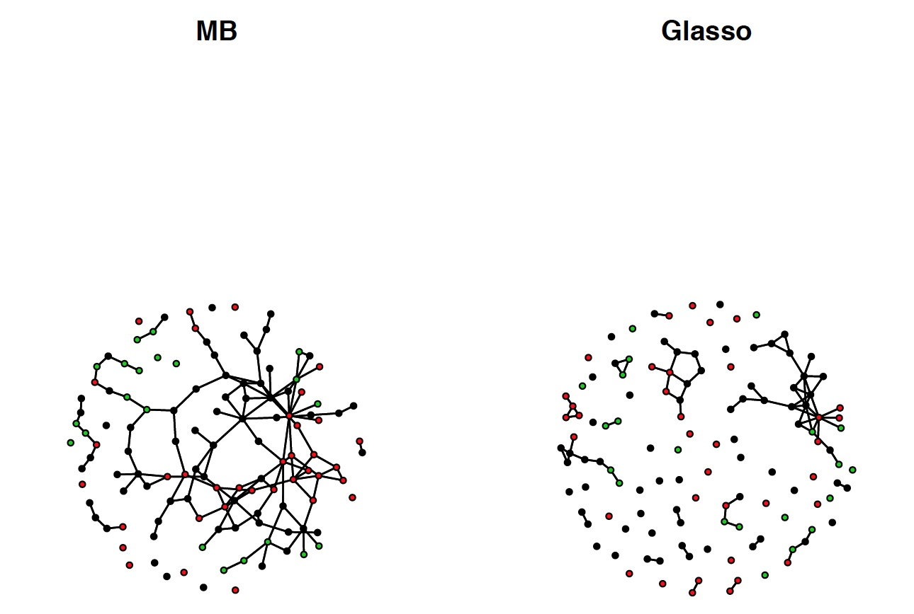

# eDNA Practice for SpiecEasi

#### Installation
```
library(devtools)
devtools::install_github('zdk123/SpiecEasi', ref='multi')
```

## SpiecEasi_Single.R  
This script can be run in R to see how a single example eDNA file can be run through SpiecEasi. It takes the 16s.csv file as input, reads in the data, runs two SpiecEasi methods, and plots the data using iGraph. The script can be run all at once (by hitting the source button at the top right of the R studio window) from a directory containing the data file or can be run line by line. To run your own data file, simply change the name of the input in line 27. The output will look like a configuration of the networks below:   
(note: the relative placement of the clusters can change)  

Figure 1: SpiecEasi_Single.R Output for 16S 


## SpiecEasi_Multi.R
This script is similar to SpiecEasi_Single.R (above) but allows ASV or OTU tables from multiple primers to be considered at once. Input files can be changed by modifying the list in line 24. In this case, the results are plotted with the network package and each color of dot corresponds to a particular primer or input file. Example output:  

Figure 2: SpiecEasi_Multi.R Output for 16S, CO1, and PITS


## SpiecEasi_Full_E_v2.R
This script can be run from the terminal command-line which makes it possible to incorporate it as part of the pipeline that returns the ASVs or OTUs. It has several options:  
* `--input_file`  
__(ONLY REQUIRED OPTION)__ Follow this tag with the name of your data file or a text file listing multiple data files with one file name per line.   
* `--name_correct`
ANACAPA output tables begins the name of each sample with the primer used on it. In order to run SpiecEasi all of the sample names must match and therefore the prefix must be removed. To do this, add this flag to the command and specify TRUE.  
* `--multi_se`
To run more than one file at a time for a single network, add this flag to the command and specify TRUE.
* `--plot_output`
This flag can be used to specify the name of the file the script will output the plotted networks to. If no input is specified, the script will create a plot file name from the name of the input file.  
* The following options can be used to specify options for the SpiecEasi command.  
`--min_presence`  
`--n_lambda`  
`--stars_thresh`  
`--rep_num`  

#### Example Command and Output: 
Run from the terminal  
(note: do not be perturbed by the initial text that pops up on the screen. It will be output messages from loading the various packages.)  
(note: also do not be worried by the amount of time it takes the script to run. Can take several minutes depending on the size of the files.)

```
Rscript SpiecEasi_Full_E_v2.R --input_file inList.txt --multi TRUE --name_correct TRUE --n_lambda 50 --rep_num 50 --stars_thresh 0.05 --plot_output Example  
```

Figure 3: SpiecEasi_Full_E_v2.R Output for 16S, CO1, and PITS


## Final (Temporary) Note
Ignore warnings from the plotting steps if a plot is still produced. 